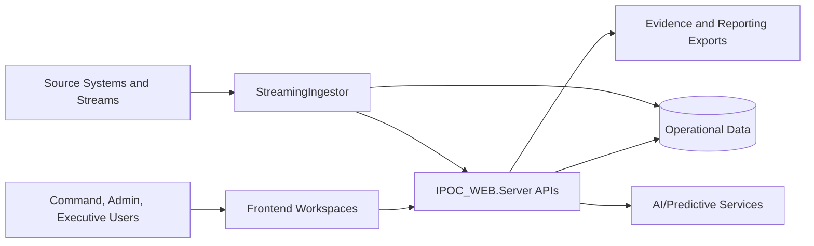

# IPOC

Incident Preparedness Operations Center (IPOC) is a modern command-and-coordination platform for emergency management and public health operations. It unifies incident command, resource posture, executive reporting, governance evidence, and AI-assisted decision support in one architecture.

## Work In Progress
This solution is actively evolving. Current capabilities are implementation-grounded and operationally usable, while additional parity, hardening, and packaging improvements continue through planned increments.

## Why Organizations Adopt IPOC
- **Command clarity**: ICS-aligned workflows across Incidents, Operations, Planning, Logistics, and Finance/Admin.
- **Operational speed**: dependency-aware tasking, command transfer continuity, and map-informed triage flows.
- **Security and compliance confidence**: HIPAA/HITRUST-aligned governance workflows, requestable audit evidence, and policy-driven operational controls.
- **Executive confidence**: decision-ready reporting, replay evidence, and structured AAR/HVA outputs.
- **Governance readiness**: auditable session/auth/admin evidence exports and compliance-oriented control narratives.
- **AI with guardrails**: predictive and co-pilot assistance with explicit human-approval expectations.

## Solution at a Glance

## Core Feature Areas
- Incident Command Workspace and ICS scenario guidance
- Operations/Planning/Logistics/Finance execution lanes
- Common Operating Picture and risk-oriented workflows
- Reporting, executive briefs, AAR/HVA readiness, and replay exports
- Admin governance, session controls, and audit evidence pathways
- AI Incident Co-Pilot and predictive analytics support

## Architecture and Reference Documentation
For complete architecture context, workflows, security/compliance posture, AI/analytics model, and deployment guidance:

- [Architecture Reference Index](./docs/architecture/README.md)
- [System Context and Value Proposition](./docs/architecture/01_System_Context_and_Value_Proposition.md)
- [Solution Component Architecture](./docs/architecture/02_Solution_Component_Architecture.md)
- [Data, Integration, and Interoperability Architecture](./docs/architecture/03_Data_Integration_and_Interop_Architecture.md)
- [Operational Workflows and Command Model](./docs/architecture/04_Operational_Workflows_and_Command_Model.md)
- [Security, Compliance, and Governance Architecture](./docs/architecture/05_Security_Compliance_and_Governance_Architecture.md)
- [AI and Analytics Architecture](./docs/architecture/06_AI_and_Analytics_Architecture.md)
- [Deployment, Operability, and Extensibility](./docs/architecture/07_Deployment_Operability_and_Extensibility.md)

## Repository Structure
- `frontend/` - React + TypeScript command experience
- `IPOC_WEB.Server/` - .NET 10 API and governance services
- `IPOC_WEB.AppHost/` - app host/orchestration project
- `IPOC_WEB.StreamingIngestor/` - .NET worker for stream simulation
- `data/` - database initialization script and Azure SQL data-tier transfer guidance
- `planning/` - implementation strategy and evidence artifacts
- `security-compliance/` - compliance and operations supporting artifacts

## Quick Start (Developer)
1. Restore and build solution:
   - `dotnet build IPOC_WEB.slnx`
2. Create local runtime config files from examples (required):
   - `copy IPOC_WEB.Server\\appsettings.example.json IPOC_WEB.Server\\appsettings.json`
   - `copy IPOC_WEB.Server\\appsettings.Development.example.json IPOC_WEB.Server\\appsettings.Development.json`
	  - `copy frontend\\.env.example frontend\\.env.development`
   - Replace placeholder values with your local settings/secrets.
   - Runtime files must not include `.example` in the filename.
3. Start the app host and frontend stack for local operation:
   - `dotnet run --project IPOC_WEB.AppHost/IPOC_WEB.AppHost.csproj --launch-profile https`
4. Run UI smoke validation:
   - `npm run smoke:ui --prefix frontend`

## Data and Cache Setup References
- **Local database schema/bootstrap script**:
  - `data/iocem-db-script.sql`
  - Run this script against your local/dev SQL target when initializing a new IOCEM database instance.
- **Azure SQL import into a different logical server (BACPAC flow)**:
  - `data/data-tier-app/import-into-other-azure-sql-database-server.md`
  - Use this when transferring data-tier artifacts to a new Azure SQL server/database.
- **Cache runtime mode (local vs Redis)**:
  - Local/in-memory cache is supported for developer startup.
  - Redis mode is supported for shared/runtime consistency (including Docker-hosted Redis in local environments).
  - Configure cache behavior in server settings (`Cache:UseRedis`) and validate via Administrator cache controls in the app.

## Local Rendering Recovery (if frontend does not load)
- Confirm local runtime files exist and are populated:
  - `IPOC_WEB.Server/appsettings.json`
  - `IPOC_WEB.Server/appsettings.Development.json`
  - `frontend/.env.development`
- If Vite reports port bind errors (`EACCES` / `EADDRINUSE`), use a non-reserved local port and keep AppHost + Vite aligned.
- Current frontend dev endpoint is set to `51015`.
- If Windows reserved ports change on your machine, check with:
  - `netsh int ipv4 show excludedportrange protocol=tcp`

## Implementation Notes
- Claims in architecture docs are aligned to current repository implementation and roadmap posture.
- Compliance narratives describe readiness/alignment workflows and do not represent automatic certification.
- Data-tier migration and bootstrap references:
  - `data/iocem-db-script.sql`
  - `data/data-tier-app/import-into-other-azure-sql-database-server.md`
- Local secret-bearing configuration files are intentionally ignored and untracked:
  - `IPOC_WEB.Server/appsettings.json`
  - `IPOC_WEB.Server/appsettings.Development.json`
  - `frontend/.env.development`
- Commit-safe templates are provided as:
  - `IPOC_WEB.Server/appsettings.example.json`
  - `IPOC_WEB.Server/appsettings.Development.example.json`
  - `frontend/.env.example`
