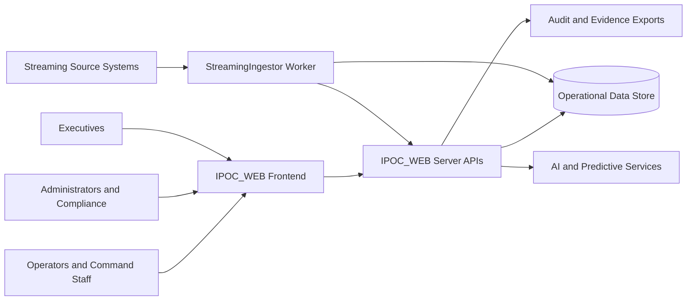
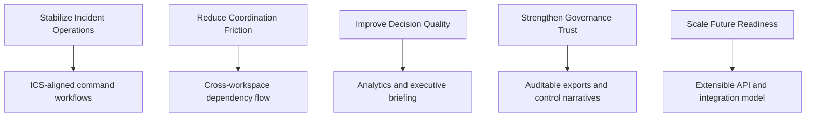

# 01. System Context and Value Proposition

## Executive Overview and How to Use This Document
IPOC_WEB is best understood first through mission fit: the operating problem it solves, the stakeholders it serves, and the outcomes it is expected to improve. This section frames that strategic baseline so later technical details remain anchored to command effectiveness, governance trust, and implementation realism.

Recommended use in three modes:
1. **Executive alignment**: validate that platform capabilities map to command, governance, and readiness objectives.
2. **Program planning**: define success criteria and adoption priorities before implementation sequencing.
3. **Implementation governance**: ensure every technical increment ties back to command-cycle value and evidence quality.

For customer-facing conversations, use this section to communicate both ambition and boundary: IPOC_WEB is a command-and-coordination platform built for evidence-grade operational governance.

## Overview
IPOC_WEB is an Incident Preparedness Operations Center platform designed for emergency management and public health operations. It unifies incident command, resource coordination, reporting, governance, and continuous improvement in a single operational system.

## Why This Matters for Enterprise Adoption
- Fragmented incident tooling creates decision latency and inconsistent accountability.
- Leadership requires both operational speed and audit-ready traceability.
- Teams need one architecture that supports command execution, analytics, and compliance narratives.

IPOC_WEB addresses these pressures by converging execution workflows and governance evidence into a single operating rhythm.

## Strategic Value
- Accelerates command decision cycles from detection through closure.
- Improves cross-functional coordination across operations, planning, logistics, and finance/admin.
- Provides evidence-grade exports and audit trails for governance and compliance workflows.
- Introduces AI-assisted decision support with explicit human approval controls.

## Stakeholder Map
- Incident Command and Section Leads (Operations, Planning, Logistics, Finance/Admin)
- Administrators and Compliance Analysts
- Executive Leadership and Policy Teams
- Integration and Platform Engineering teams

## Capability Domains
- Incident Command Workspace and ICS-aligned workflows
- Resource and capacity posture (including healthcare bed/resource baseline)
- Communications and coordination support
- Common Operating Picture (COP) and map-first operations
- Reporting, AAR/HVA readiness, and executive decision support
- Security, audit, and governance controls
- AI Incident Co-Pilot and predictive analytics

## Persona-Centered Value Narrative
- **Incident Command**: obtains a clear command picture with explicit ownership and transition continuity.
- **Section Leads**: execute in role-specific workspaces while preserving dependency visibility.
- **Administrators/Compliance**: produce requestable evidence with lower manual assembly burden.
- **Executives**: receive decision-ready summaries with trend context and operational provenance.

## Solution Context Diagram

## Business Outcomes
- Faster incident stabilization through structured command workflows.
- Higher operational transparency through explicit ownership, dependency, and timeline evidence.
- Better executive alignment through decision-ready analytics and concise command briefs.
- Improved compliance readiness via repeatable, requestable evidence pathways.

## Mission-to-Capability Mapping

## Practical Usage Guidance
- Use this document first in architecture reviews to set scope and outcomes.
- Revisit this document at each major release to confirm roadmap increments preserve mission alignment.
- Use this as the reference baseline when evaluating external platform parity or differentiation claims.

## Scope Boundary
- Platform focus is command-and-control, preparedness, and operational governance.
- Clinical patient-tracking workflows are outside this baseline scope.
