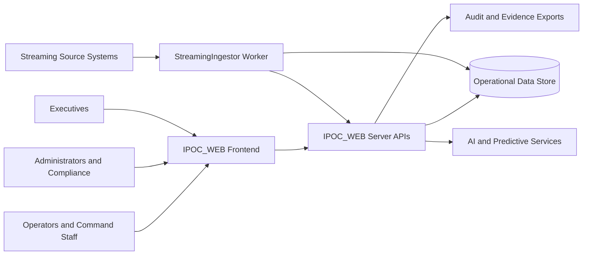

# 01. System Context and Value Proposition

## Overview
IPOC_WEB is an Incident Preparedness Operations Center platform designed for emergency management and public health operations. It unifies incident command, resource coordination, reporting, governance, and continuous improvement in a single operational system.

## Strategic Value
- Accelerates command decision cycles from detection through closure.
- Improves cross-functional coordination across operations, planning, logistics, and finance/admin.
- Provides evidence-grade exports and audit trails for governance and compliance workflows.
- Introduces AI-assisted decision support with explicit human approval controls.

## Stakeholder Map
- Incident Command and Section Leads (Operations, Planning, Logistics, Finance/Admin)
- Administrators and Compliance Analysts
- Executive Leadership and Policy Teams
- Integration and Platform Engineering teams

## Capability Domains
- Incident Command Workspace and ICS-aligned workflows
- Resource and capacity posture (including healthcare bed/resource baseline)
- Communications and coordination support
- Common Operating Picture (COP) and map-first operations
- Reporting, AAR/HVA readiness, and executive decision support
- Security, audit, and governance controls
- AI Incident Co-Pilot and predictive analytics

## Solution Context Diagram

## Business Outcomes
- Faster incident stabilization through structured command workflows.
- Higher operational transparency through explicit ownership, dependency, and timeline evidence.
- Better executive alignment through decision-ready analytics and concise command briefs.
- Improved compliance readiness via repeatable, requestable evidence pathways.

## Scope Boundary
- Platform focus is command-and-control, preparedness, and operational governance.
- Clinical patient-tracking workflows are outside this baseline scope.
