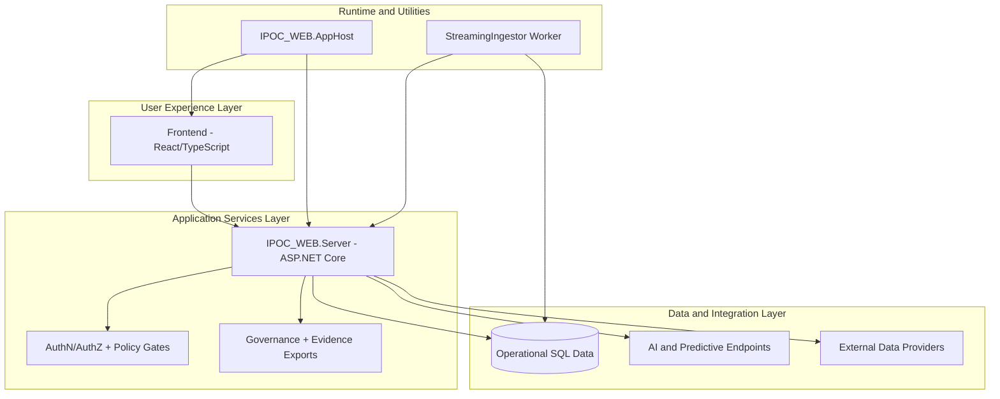
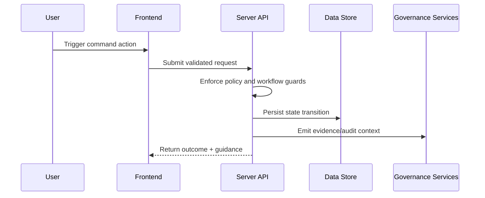

# 02. Solution Component Architecture

## Executive Overview and How to Use This Document
This document explains how IPOC_WEB is physically and logically assembled across user experience, API services, runtime hosting, and ingestion utilities. It is intended to answer the implementation-critical questions: where capabilities live, how responsibilities are separated, and how data and control flow across components.

Use this document when:
- defining solution boundaries for delivery teams,
- planning integration or extension points,
- evaluating reliability, security, and maintainability impacts of architecture decisions.

For enterprise architecture reviews, this file should be treated as the structural blueprint that connects strategic goals to deployable software components.

## Component Inventory
- **Frontend (`frontend`)**: React + TypeScript + Vite user experience across command workspaces.
- **Backend (`IPOC_WEB.Server`)**: ASP.NET Core (.NET 10) API layer, policy enforcement, workflow orchestration, export generation.
- **App Host (`IPOC_WEB.AppHost`)**: local orchestration and developer-host execution support.
- **Streaming Ingestor (`IPOC_WEB.StreamingIngestor`)**: .NET Worker utility for API- and DB-mode stream ingestion simulation.

## Architectural Design Rationale
- **Frontend separation** keeps command UX evolution decoupled from API deployment cadence.
- **Backend policy and governance concentration** ensures control enforcement remains centralized and auditable.
- **Dedicated worker utility** enables integration validation and ingestion contract testing without production coupling.
- **AppHost orchestration** simplifies local environment consistency and accelerates development onboarding.

## High-Level Architecture

## Frontend Architecture Highlights
- Workspace-based navigation for core domains (Incidents, Operations, Planning, Logistics, Finance/Admin, Reporting, COP, After Action).
- User Guide with scenario-oriented operational runbooks.
- Admin workspace for user/session/governance tasks.
- UI smoke harness validates architecture-critical anchors and interaction contracts.

## Backend Architecture Highlights
- Versioned REST endpoints under `/api/v1`.
- Explicit command lifecycle and governance guardrails.
- Durable export pathways for operational and compliance evidence.
- Feature-flag-aware AI/predictive integration surfaces.

## Responsibility Matrix
| Layer | Primary Responsibility | Secondary Responsibility |
|---|---|---|
| Frontend | Operational UX and workflow interaction | Contextual guidance and action ergonomics |
| Server APIs | Domain orchestration and policy enforcement | Export/evidence generation |
| Data Store | Durable operational state | Historical traceability support |
| Worker | Stream ingestion simulation and contract validation | Integration test acceleration |

## Request and Control Flow Narrative

## Practical Usage Guidance
- Use this document to allocate ownership boundaries across teams.
- Use the matrix and flow sections to evaluate impact before introducing new modules.
- Keep this file synchronized with actual repository topology to preserve architectural credibility.

## Worker Architecture Highlights
- Supports streaming ingestion in:
  - `api` mode: HTTP posts to import endpoints.
  - `db` mode: direct load into target tables with idempotency evidence updates.

## Non-Functional Design Themes
- Operational traceability and auditable actions.
- Fail-safe validation and explicit guardrail messaging.
- Modular evolution of advanced analytics and AI capabilities.
