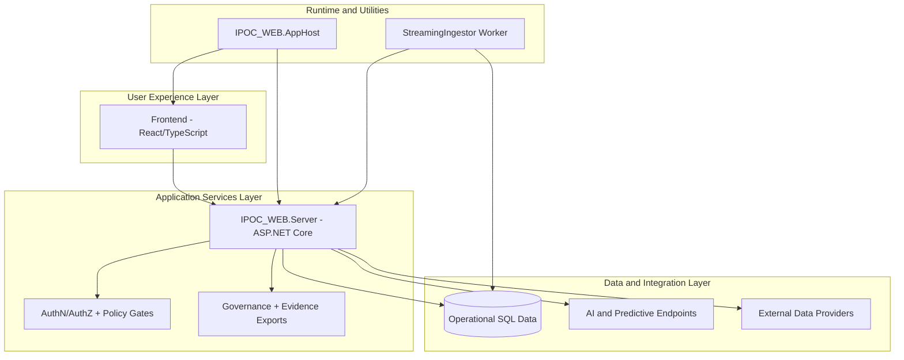

# 02. Solution Component Architecture

## Component Inventory
- **Frontend (`frontend`)**: React + TypeScript + Vite user experience across command workspaces.
- **Backend (`IPOC_WEB.Server`)**: ASP.NET Core (.NET 10) API layer, policy enforcement, workflow orchestration, export generation.
- **App Host (`IPOC_WEB.AppHost`)**: local orchestration and developer-host execution support.
- **Streaming Ingestor (`IPOC_WEB.StreamingIngestor`)**: .NET Worker utility for API- and DB-mode stream ingestion simulation.

## High-Level Architecture

## Frontend Architecture Highlights
- Workspace-based navigation for core domains (Incidents, Operations, Planning, Logistics, Finance/Admin, Reporting, COP, After Action).
- User Guide with scenario-oriented operational runbooks.
- Admin workspace for user/session/governance tasks.
- UI smoke harness validates architecture-critical anchors and interaction contracts.

## Backend Architecture Highlights
- Versioned REST endpoints under `/api/v1`.
- Explicit command lifecycle and governance guardrails.
- Durable export pathways for operational and compliance evidence.
- Feature-flag-aware AI/predictive integration surfaces.

## Worker Architecture Highlights
- Supports streaming ingestion in:
  - `api` mode: HTTP posts to import endpoints.
  - `db` mode: direct load into target tables with idempotency evidence updates.

## Non-Functional Design Themes
- Operational traceability and auditable actions.
- Fail-safe validation and explicit guardrail messaging.
- Modular evolution of advanced analytics and AI capabilities.
