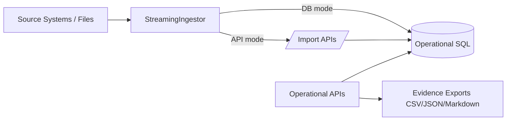
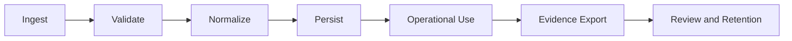
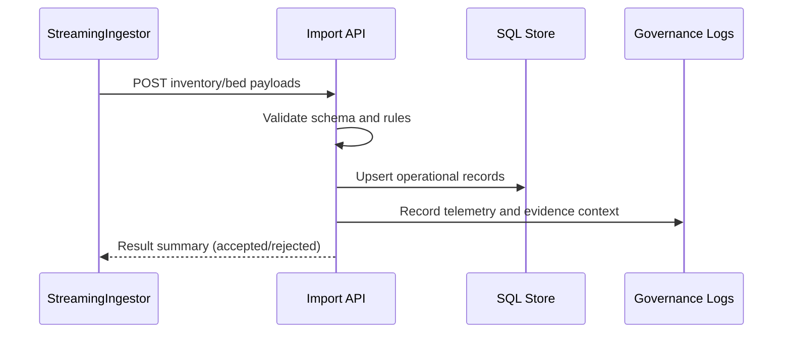

# 03. Data, Integration, and Interoperability Architecture

## Executive Overview and How to Use This Document
This document defines how operational data enters, moves through, and exits IPOC_WEB. It covers ingestion modes, data contracts, interoperability posture, and evidence artifact pathways used by both operations and governance teams. For enterprise implementers, this is the primary source for integration design, data stewardship responsibilities, and auditability expectations.

Use this document to:
- design source-system onboarding and connector strategy,
- validate contract and idempotency requirements,
- plan evidence retention/export handling for governance and compliance.

In customer-facing architecture reviews, this file demonstrates that IPOC_WEB is not just a UI platform, but a governed operational data system.

## Data Domains
- Incident and command workflow entities
- Task, timeline, and objective records
- Resource and bed availability posture
- Session/auth and admin governance events
- Reporting outputs and evidence artifacts

## Integration Value Narrative
- Enables a controlled path from source events to operational decisions.
- Preserves context and traceability for post-incident analytics and compliance response.
- Supports phased interoperability maturity (baseline adapters now, broader connectors over time).

## Data Flow Overview

## Integration Patterns
1. **Synchronous API ingestion**
   - Import endpoints for resources and bed availability.
2. **Direct-load simulation path**
   - Worker writes directly to data tables in controlled scenarios.
3. **Interoperability baseline (FHIR)**
   - Bed availability adapter contract and baseline transformer support.
4. **Evidence export pipeline**
   - Produces requestable artifacts for operational and compliance use.

## Data Lifecycle Model

## Interop and Contracting Principles
- Stable endpoint and payload contracts for operational workflows.
- Idempotency and source-message traceability in ingestion paths.
- Reject-report and validation-first posture for import quality.

## Data Governance Considerations
- Role-constrained access to sensitive administrative workflows.
- Export artifacts include context metadata for traceability.
- Retention and downstream handling follow governance runbooks.

## Interoperability Maturity Path
1. **Baseline**: validated API and stream simulation paths.
2. **Expansion**: additional adapter contracts and source-specific transformers.
3. **Operational hardening**: richer telemetry, replay tooling, and reconciliation workflows.
4. **Enterprise scale**: repeatable onboarding playbooks and governance automation.

## Practical Usage Guidance
- Use this file as the integration design checklist before onboarding a new source feed.
- Pair this document with security/compliance architecture for data-handling control reviews.
- Use the lifecycle model to identify where quality, observability, and policy checks should be added.

## Representative Workflow: Bed/Resource Import

