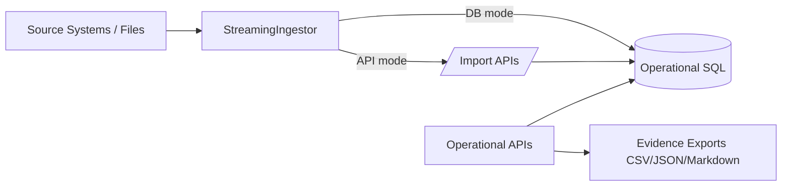
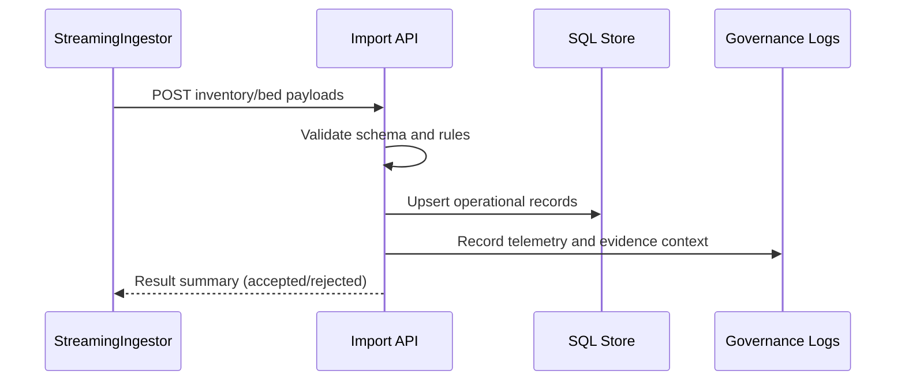

# 03. Data, Integration, and Interoperability Architecture

## Data Domains
- Incident and command workflow entities
- Task, timeline, and objective records
- Resource and bed availability posture
- Session/auth and admin governance events
- Reporting outputs and evidence artifacts

## Data Flow Overview

## Integration Patterns
1. **Synchronous API ingestion**
   - Import endpoints for resources and bed availability.
2. **Direct-load simulation path**
   - Worker writes directly to data tables in controlled scenarios.
3. **Interoperability baseline (FHIR)**
   - Bed availability adapter contract and baseline transformer support.
4. **Evidence export pipeline**
   - Produces requestable artifacts for operational and compliance use.

## Interop and Contracting Principles
- Stable endpoint and payload contracts for operational workflows.
- Idempotency and source-message traceability in ingestion paths.
- Reject-report and validation-first posture for import quality.

## Data Governance Considerations
- Role-constrained access to sensitive administrative workflows.
- Export artifacts include context metadata for traceability.
- Retention and downstream handling follow governance runbooks.

## Representative Workflow: Bed/Resource Import

