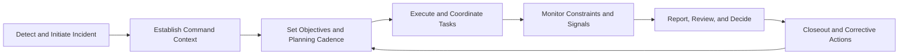
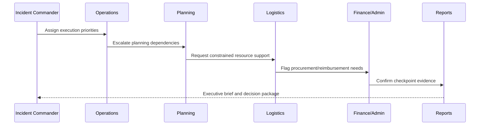

# 04. Operational Workflows and Command Model

## Executive Overview and How to Use This Document
Operational architecture is where platform value becomes tangible. This section translates incident-command doctrine into repeatable workflows across modules and roles, showing how IPOC_WEB performs under real command tempo rather than only in static feature terms.

Use this guide to:
- align command doctrine to platform workflow design,
- train operators and section leads on role-specific execution paths,
- define briefing and handoff expectations for continuity across shifts.

When presenting to enterprise stakeholders, emphasize that workflow clarity and accountability continuity are the primary differentiators in this architecture slice.

## Command Model
IPOC_WEB applies an ICS/NIMS-aligned operational model across module workflows. It emphasizes explicit command ownership, recurring planning cadence, dependency-aware execution, and auditable handoff.

## Operational Value Narrative
- Reduces command friction by making ownership and dependency status explicit.
- Improves shift continuity via transfer ledger workflows and briefing-ready context.
- Improves closure quality through integrated reporting and corrective-action linkage.

## Core Command Cycle

## Cross-Workspace Workflow
- **Incidents**: incident setup, command context, timeline baseline.
- **Operations**: execution directives, blockers, and escalations.
- **Planning**: SITREP/IAP cadence and objective readiness.
- **Logistics**: shortages, weather/constraint triage, resource posture.
- **Finance/Admin**: reimbursement/procurement and governance checkpoints.
- **Reports/After Action**: decision artifacts, replay evidence, corrective plans.

## Role-to-Workflow Alignment
| Role | Primary Workflow Surface | Key Outcome |
|---|---|---|
| Incident Commander | Incidents + Reports | Decision continuity and command posture |
| Operations Lead | Operations | Directive execution and blocker resolution |
| Planning Lead | Planning | Objective readiness and cadence governance |
| Logistics Lead | Logistics + COP | Constraint triage and resource stabilization |
| Finance/Admin Lead | Finance/Admin | Checkpoint evidence and governance closure |

## Command Transfer and Handoff
- Transfer ledger captures command transitions with explicit accountability.
- Quick-range and preset filters accelerate shift turnover evidence slicing.
- Deep links and guide narratives support briefing continuity across teams.

## Scenario-Based ICS Narrative
- Small Incident: lean command path and rapid stabilization.
- Multi-Agency Expansion: section activation and unified-command cadence.
- Demobilization-heavy closeout: handoff and unresolved action ownership.

## Shift Handoff Workflow

## Practical Usage Guidance
- Use this guide in command tabletop exercises and onboarding sessions.
- Use role alignment and handoff diagrams as briefing artifacts during shift turnover.
- Re-validate workflows whenever command policy or module behavior changes.

## Decision Workflow Diagram

