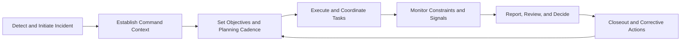
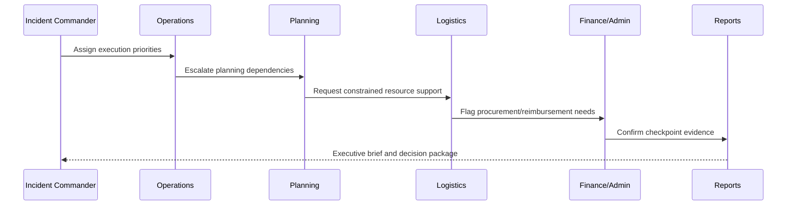

# 04. Operational Workflows and Command Model

## Command Model
IPOC_WEB applies an ICS/NIMS-aligned operational model across module workflows. It emphasizes explicit command ownership, recurring planning cadence, dependency-aware execution, and auditable handoff.

## Core Command Cycle

## Cross-Workspace Workflow
- **Incidents**: incident setup, command context, timeline baseline.
- **Operations**: execution directives, blockers, and escalations.
- **Planning**: SITREP/IAP cadence and objective readiness.
- **Logistics**: shortages, weather/constraint triage, resource posture.
- **Finance/Admin**: reimbursement/procurement and governance checkpoints.
- **Reports/After Action**: decision artifacts, replay evidence, corrective plans.

## Command Transfer and Handoff
- Transfer ledger captures command transitions with explicit accountability.
- Quick-range and preset filters accelerate shift turnover evidence slicing.
- Deep links and guide narratives support briefing continuity across teams.

## Scenario-Based ICS Narrative
- Small Incident: lean command path and rapid stabilization.
- Multi-Agency Expansion: section activation and unified-command cadence.
- Demobilization-heavy closeout: handoff and unresolved action ownership.

## Decision Workflow Diagram

