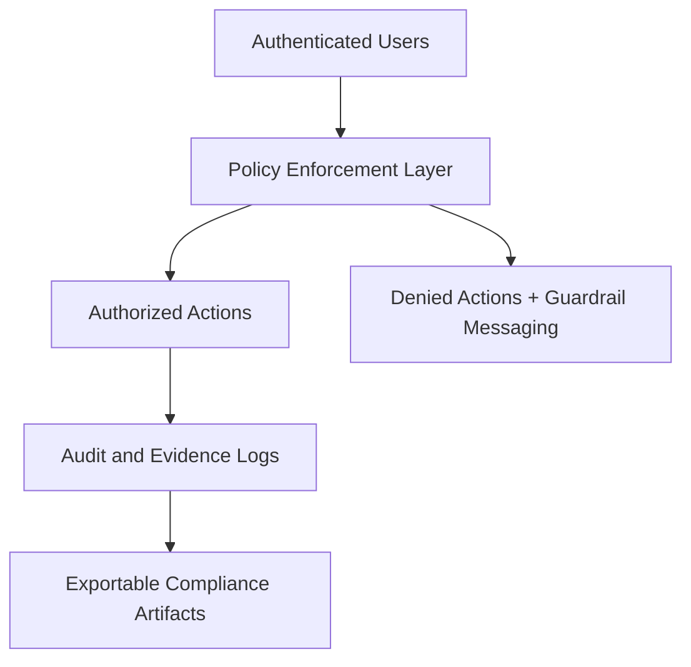
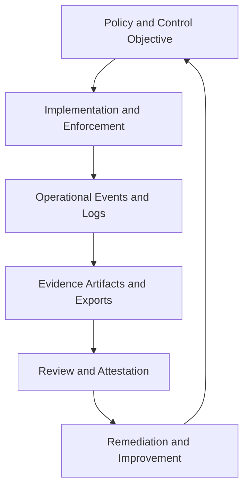
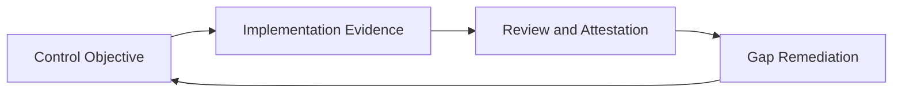

# 05. Security, Compliance, and Governance Architecture

## Executive Overview and How to Use This Document
This document explains how IPOC_WEB enforces trust: who can do what, how actions are governed, and how evidence is produced for audit and compliance workflows. It should be used as the primary architecture reference for security and compliance discussions with customers, internal governance teams, and implementation partners.

Use this document to:
- validate access and control architecture against organizational policy,
- design evidence-generation workflows for requestable compliance artifacts,
- communicate the difference between readiness posture and formal certification outcomes.

For enterprise audiences, this section is essential to demonstrate that operational speed and governance rigor are designed together, not traded off.

## Security Model
- Role-based access control with module/action-level constraints.
- Administrative controls for session governance and auditable operations.
- Strict-auth and smoke validation artifacts for critical endpoints.

## Security and Governance Value Narrative
- Enables least-privilege execution while preserving operational productivity.
- Makes high-impact administrative and command actions auditable by default.
- Supports repeatable compliance evidence assembly with less manual effort.

## Governance Control Layers
1. **Identity and Access Governance**
   - Least-privilege role assignments
   - Session administration and access review workflows
2. **Audit and Evidence Governance**
   - Requestable export workflows for auth/session/admin evidence
   - Operational and command evidence packaging
3. **Operational Governance**
   - Command lifecycle guardrails and explicit checkpointing
   - Human-approval requirements for AI-assisted outputs

## Security and Compliance Diagram

## HIPAA/HITRUST Alignment Narrative (Implementation Posture)
IPOC_WEB includes governance and evidence pathways that support HIPAA Security Rule and HITRUST-aligned operational readiness activities, including:
- role and access governance workflows,
- auditable activity and decision logging,
- evidence export capabilities for review and attestation workflows,
- incident response and corrective-action support artifacts.

## Control-to-Evidence Traceability Model

## Governance Operating Cadence
1. Daily: monitor privileged actions and anomalies.
2. Weekly: review high-impact admin and command transitions.
3. Monthly/Quarterly: perform control attestations and remediation tracking.
4. Annual: refresh policy mappings and assurance narratives.

## Assurance Boundary
Architecture and workflow controls can support compliance readiness, but formal compliance attestation or certification requires organization-specific governance execution and independent assessment.

## Practical Usage Guidance
- Use this document with security and legal teams during deployment planning.
- Pair it with data architecture when defining retention and access controls.
- Use traceability model and cadence sections to structure assessment preparation.

## Compliance Evidence Lifecycle

