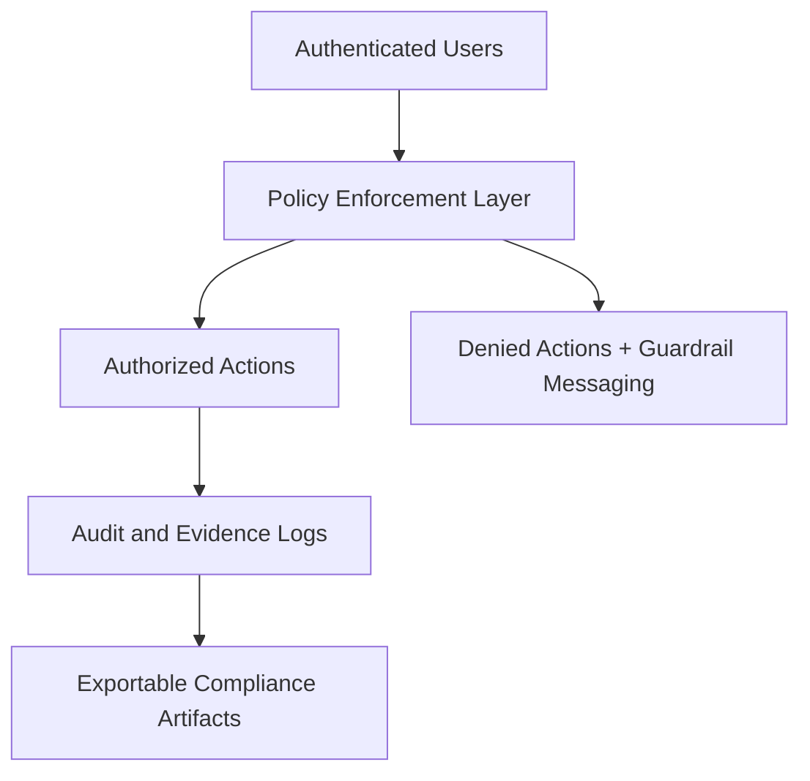
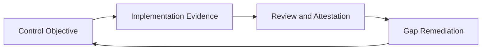

# 05. Security, Compliance, and Governance Architecture

## Security Model
- Role-based access control with module/action-level constraints.
- Administrative controls for session governance and auditable operations.
- Strict-auth and smoke validation artifacts for critical endpoints.

## Governance Control Layers
1. **Identity and Access Governance**
   - Least-privilege role assignments
   - Session administration and access review workflows
2. **Audit and Evidence Governance**
   - Requestable export workflows for auth/session/admin evidence
   - Operational and command evidence packaging
3. **Operational Governance**
   - Command lifecycle guardrails and explicit checkpointing
   - Human-approval requirements for AI-assisted outputs

## Security and Compliance Diagram

## HIPAA/HITRUST Alignment Narrative (Implementation Posture)
IPOC_WEB includes governance and evidence pathways that support HIPAA Security Rule and HITRUST-aligned operational readiness activities, including:
- role and access governance workflows,
- auditable activity and decision logging,
- evidence export capabilities for review and attestation workflows,
- incident response and corrective-action support artifacts.

## Assurance Boundary
Architecture and workflow controls can support compliance readiness, but formal compliance attestation or certification requires organization-specific governance execution and independent assessment.

## Compliance Evidence Lifecycle

