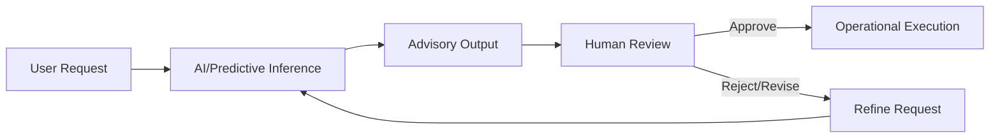
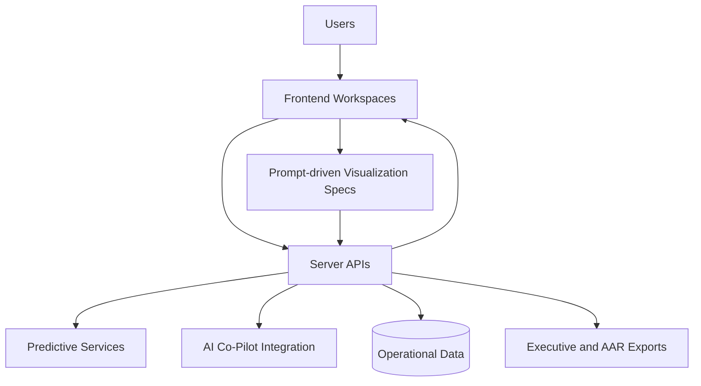
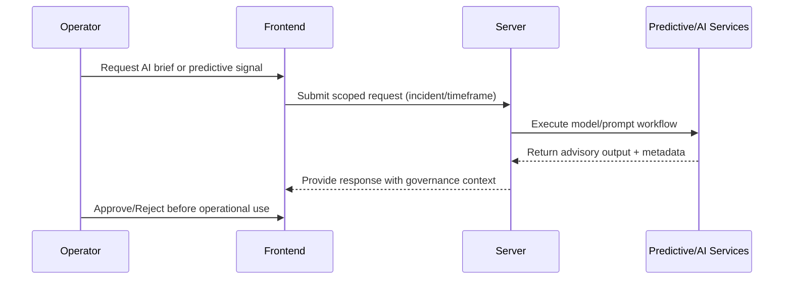

# 06. AI and Analytics Architecture

## Executive Overview and How to Use This Document
This document describes how IPOC_WEB turns operational data into decision support through AI-assisted workflows and analytics products, while preserving human command authority. It is intended for architecture reviewers who need to evaluate both innovation value and governance safety.

Use this document to:
- understand where AI is used and where humans remain the decision authority,
- align analytics outputs with command and executive reporting workflows,
- plan extensions to predictive and visualization capabilities responsibly.

For customer positioning, this file articulates a key differentiator: actionable AI and analytics integrated directly into operational command workflows, not isolated in standalone reporting tools.

## AI and Analytics Objectives
- Deliver decision-support signals to command teams without replacing human authority.
- Provide executive-grade reporting and replay artifacts.
- Preserve traceability and governance around generated recommendations.

## Differentiation Narrative
- AI outputs are embedded in incident workflows where decisions are made.
- Generated analytics and briefs are tied to operational context and evidence flows.
- Governance guardrails (approval, feature flags, metadata context) reduce unsafe automation risk.

## Capability Areas
- AI Incident Co-Pilot for narrative assistance and structured drafting support.
- Predictive demand/supply model workflows with acceptance checks.
- Dashboard/Reports visualization generation from prompt-driven specs.
- Executive brief, AAR/HVA, and timeline export pathways.

## AI Governance Principles
- Human approval before operational execution of AI suggestions.
- Feature-flag-aware enablement to avoid unsafe or misleading UX states.
- Metadata and evidence context preserved with generated artifacts.

## Human-in-the-Loop Decision Model

## AI/Analytics Architecture Diagram

## Operational Workflow (AI-Assisted)

## Analytics Outputs
- Executive decision briefs
- Comparative and trend analytics
- Risk timeline replay exports
- AAR improvement and HVA readiness artifacts

## Practical Usage Guidance
- Use this document when defining AI governance policy with operations and compliance teams.
- Use the decision model to train teams on safe AI adoption behaviors.
- Use output categories to plan executive briefing standards and analytics backlog priorities.
