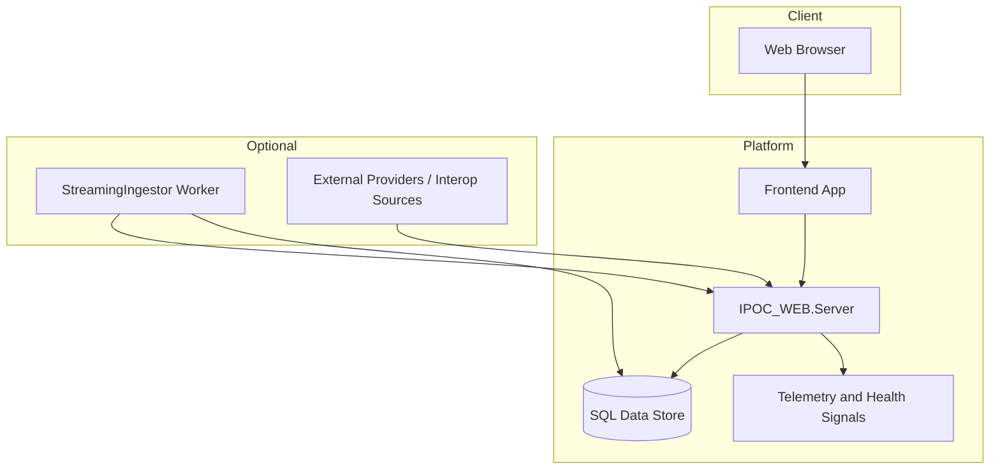

# 07. Deployment, Operability, and Extensibility

## Deployment Topology (Conceptual)

## Operability Model
- Local/AppHost-driven development and smoke validation.
- Endpoint strict-auth and governance-focused runbook validation.
- Evidence-driven release readiness artifacts.

## Reliability and Quality Practices
- Build + smoke gates integrated into daily workflow.
- Contract anchors in UI smoke tests for critical interaction surfaces.
- Guardrail messaging and explicit fallback behavior in operational UX.

## Extensibility Strategy
1. Integration adapters (additional source-system connectors).
2. Deeper analytics packaging and automation distribution.
3. Expanded map and geospatial operational overlays.
4. Additional compliance attestation workflows and evidence automation.

## Implementation Maturity Note
IPOC_WEB is in active delivery. Core workflows are implemented with continuous iteration toward broader parity and operational hardening.
