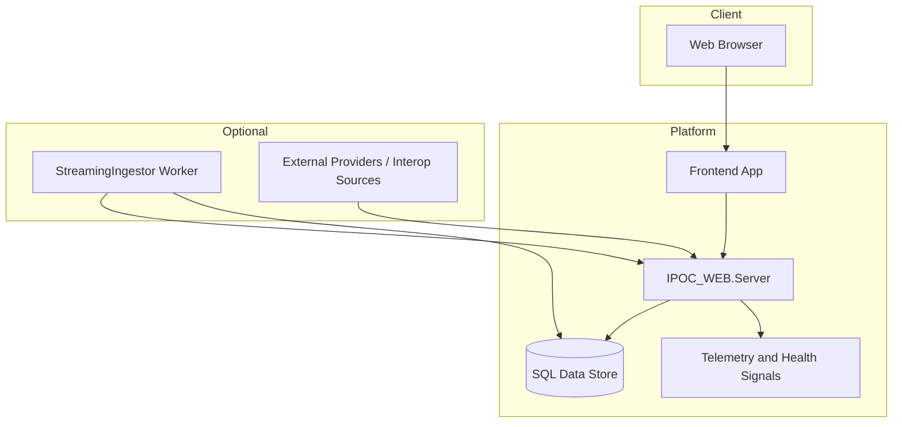

# 07. Deployment, Operability, and Extensibility

## Executive Overview and How to Use This Document
This document defines how IPOC_WEB is deployed, operated, validated, and evolved over time. It connects architecture to day-two realities: environment setup, quality gates, observability, runbook discipline, and controlled extensibility.

Use this document to:
- plan environment rollout and operational ownership,
- define validation and release-governance expectations,
- prioritize extensibility investments without destabilizing core workflows.

For enterprise customers, this is the proof that IPOC_WEB is architected for sustained operation, not only initial feature delivery.

## Deployment Topology (Conceptual)

## Operability Value Narrative
- Establishes repeatable validation paths before high-impact releases.
- Improves reliability through explicit smoke/build/runbook controls.
- Supports staged modernization with low-risk extension points.

## Operability Model
- Local/AppHost-driven development and smoke validation.
- Endpoint strict-auth and governance-focused runbook validation.
- Evidence-driven release readiness artifacts.

## Release Governance Workflow

## Reliability and Quality Practices
- Build + smoke gates integrated into daily workflow.
- Contract anchors in UI smoke tests for critical interaction surfaces.
- Guardrail messaging and explicit fallback behavior in operational UX.

## Extensibility Strategy
1. Integration adapters (additional source-system connectors).
2. Deeper analytics packaging and automation distribution.
3. Expanded map and geospatial operational overlays.
4. Additional compliance attestation workflows and evidence automation.

## Practical Usage Guidance
- Use this document as the baseline runbook for environment readiness and release checks.
- Pair deployment and observability sections with security/compliance architecture during go-live planning.
- Revisit extensibility strategy each quarter to sequence enhancements based on operational value and risk.

## Implementation Maturity Note
IPOC_WEB is in active delivery. Core workflows are implemented with continuous iteration toward broader parity and operational hardening.
